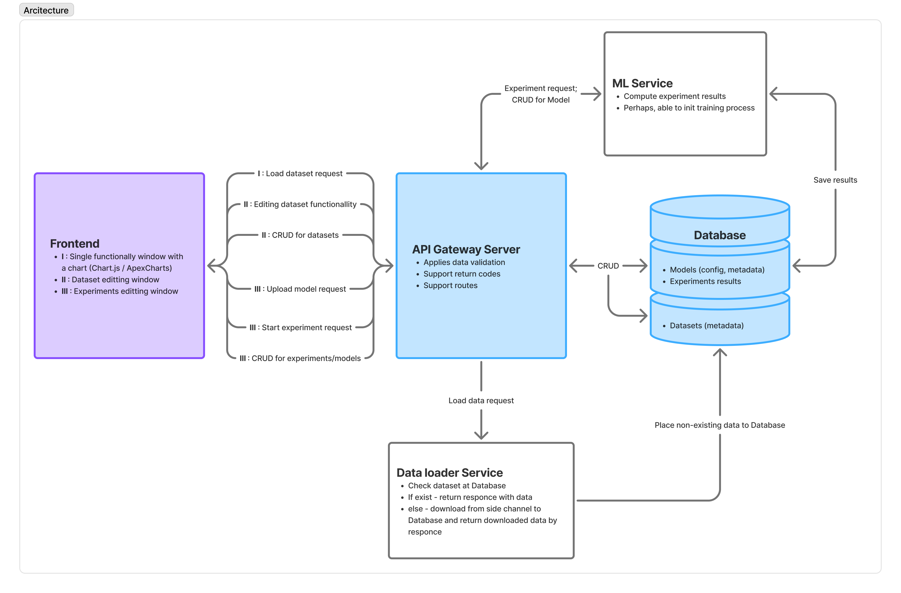

# Техническое задание

## 1.1 Краткое описание
Сервис представляет собой веб-платформу для исследования, тестирования и анализа моделей машинного обучения,предназначенных для прогнозирования динамики фондовых индексов.
Платформа обеспечивает полный цикл работы с данными и моделями - от сбора и обработки финансовых данных до визуализации результатов прогнозирования.

## 1.2 Цели проекта

- Создание единой среды для тестирования моделей прогнозирования финансовых инструментов **(А)** - костяк продукта
- Автоматизация процессов сбора, обработки и анализа финансовых данных                   **(B)** - сервис сбора данных
- Предоставление сводки сравнения эффективности различных ML-моделей                     **(C)** - сервис тестирования и хранения моделей
- Визуализация результатов прогнозирования в интуитивно понятном интерфейсе              **(D)** - визуализация данных и результатов тестирования

## 1.3 Целевая аудитория

- Исследователи в области quantitative finance
- Разработчики алгоритмических торговых систем
- Аналитики финансовых рынков
- Студенты и преподаватели финансовых дисциплин

## 2 Функциональные требования
#### 2.1 Модуль работы с данными
  - Загрузка исторических данных из внешних источников (Yahoo Finance, MOEX)
  - Поддержка форматов CSV, JSON для пользовательских данных
  - Валидация и предобработка финансовых данных
  - Расчет технических индикаторов (SMA, EMA, RSI, MACD, ATR)
  - Управление метаинформацией о датасетах
  - Хранение датасетов
  - Редактирование датасетов (нарезка интервалов, изменение интервала времени, добавление признаков)
#### 2.2 Модуль ML-экспериментов
- Создание и конфигурирование экспериментов
- Поддержка различных типов моделей: Линейная регрессия, Random Forest, ARIMA/SARIMA, LSTM нейронные сети, Prophet
- Автоматическое разделение данных на train/validation/test
#### 2.3 Модуль оценки и метрик
- Расчет метрик качества для регрессии: MSE, MAE, RMSE, R²
- Расчет метрик для классификации: Accuracy, Precision, Recall, F1-Score
- Статистический анализ результатов
- Сравнительный анализ нескольких экспериментов
#### 2.4 Модуль визуализации
- Графики "Факт vs Прогноз"
- Визуализация ошибок прогнозирования
- Интерактивные временные ряды
- Панели сравнения моделей
- Экспорт результатов в PNG/PDF/CSV

## 3 Технологический стек
#### Frontend
- Фреймворк: React 18 с TypeScript
- Сборка: Vite
- Стили: Tailwind CSS + Headless UI
- Графики: Chart.js / ApexCharts
- Маршрутизация: React Router v6
#### Backend
- Фреймворк: Python FastAPI
- База данных: PostgreSQL + Redis
- ORM: SQLAlchemy 2.0 + Alembic
- Асинхронные задачи: Celery + Redis
- ML-библиотеки: Scikit-learn, Statsmodels, TensorFlow, Prophet

## 4 Модель данных
Основные сущности:
- Dataset - метаинформация о датасетах
- FinancialData - сырые финансовые данные
- Experiment - конфигурация экспериментов
- ModelConfig - параметры моделей
- ExperimentResults - результаты выполнения
- Prediction - детальные предсказания

### Пользовательский сценарий
- Кто пользователь? - _Участник рынка, трейдер, аналитик, ML-разработчик_
- Какой у него контекст и мотивация? - _В контексте пользователь имеет потребность анализировать текущее состояние рынка,
 а также предсказывать его состояние, тестируя и обучая различные модели. Мотивацией использовать данный продукт является удобство в доступе к необходимым данным, а также качественная визуализация результатов и изолированная среда для работы._
- Что он хочет сделать? - _Протестировать модель на различных временных рядах_

